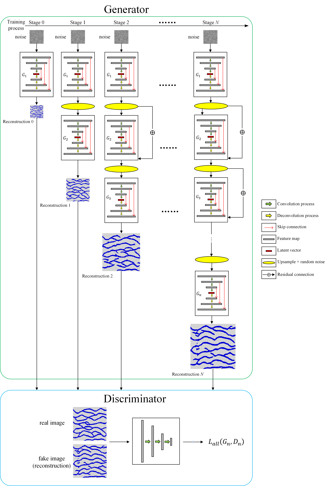

# Con_MSUGAN
for geological modeling
Based on the ConSinGAN, in this paper, we introduced the Concurrent Multi-Stage U-Net Generative Adversarial Network, and the network structure is shown as follows:

